# Diagrama de Secuencia — Ciclo de Vida Completo de una Sesión

> **Referencia TDD:** §5.3 Flujo de Datos Principal (Fases 1-6), §6.3 Procesamiento de Audio, §7.2 Ciclo de Vida del Token

Este diagrama cubre el flujo end-to-end desde que el host crea la sala hasta que los participantes descargan las pistas procesadas.

```mermaid
sequenceDiagram
    autonumber

    actor Host
    actor Guest
    participant FE_H as Frontend (Host)
    participant FE_G as Frontend (Guest)
    participant API as NestJS API
    participant WS as WebSocket Gateway
    participant SFU as mediasoup SFU
    participant S3 as SeaweedFS
    participant DB as PostgreSQL
    participant Q as BullMQ / Dragonfly
    participant PY as Python Worker

    %% ─── FASE 1: Pre-sesión ───
    rect rgb(59, 130, 246, 0.08)
        note over Host, DB: FASE 1 — Pre-sesión: Creación de sala e ingreso de participantes

        Host ->> FE_H: Crear sala (display_name, email?)
        FE_H ->> API: POST /api/rooms
        API ->> DB: INSERT rooms + participants (role: host)
        API ->> API: Generar JWT (role: host)
        API -->> FE_H: 201 { room_id, code, jwt, participant_id }
        FE_H -->> Host: Sala creada — enlace de invitación

        Host ->> Guest: Compartir enlace de invitación

        Guest ->> FE_G: Unirse a sala (display_name, email?)
        FE_G ->> API: POST /api/rooms/:id/join
        API ->> DB: INSERT participants (role: guest)
        API ->> API: Generar JWT (role: guest)
        API -->> FE_G: 200 { jwt, participant_id }

        par Conexión WebSocket + SFU (Host)
            FE_H ->> WS: room:join { token: jwt }
            WS ->> WS: Validar JWT (Guard)
            WS ->> SFU: Crear WebRtcTransport (send + recv)
            WS -->> FE_H: transport params (id, iceParameters, dtlsParameters)
            FE_H ->> WS: media:transport-connect { dtlsParameters }
            FE_H ->> WS: media:produce { rtpParameters }
            WS ->> SFU: router.createProducer()
            WS -->> FE_H: producer_id
        and Conexión WebSocket + SFU (Guest)
            FE_G ->> WS: room:join { token: jwt }
            WS ->> WS: Validar JWT (Guard)
            WS ->> SFU: Crear WebRtcTransport (send + recv)
            WS -->> FE_G: transport params
            FE_G ->> WS: media:transport-connect
            FE_G ->> WS: media:produce { rtpParameters }
            WS ->> SFU: router.createProducer()
            WS -->> FE_G: producer_id
        end

        note over WS, SFU: Se crean Consumers para que cada participante reciba el audio de los demás
        WS ->> SFU: router.createConsumer() para cada par
        WS -->> FE_H: media:consume { producerId, rtpParameters }
        WS -->> FE_G: media:consume { producerId, rtpParameters }

        note over FE_H, FE_G: Comunicación de voz en tiempo real activa vía SFU
        FE_H ->> FE_H: Prueba de sonido (10s grab + play)
        FE_G ->> FE_G: Prueba de sonido (10s grab + play)
    end

    %% ─── FASE 2: Inicio de grabación ───
    rect rgb(34, 197, 94, 0.08)
        note over Host, DB: FASE 2 — Inicio de grabación con cuenta regresiva

        Host ->> FE_H: Click "Iniciar Grabación"
        FE_H ->> API: POST /api/rooms/:id/recording/start
        API ->> DB: INSERT recording_sessions (status: recording)
        API ->> WS: Emitir evento de countdown

        WS -->> FE_H: recording:countdown { seconds: 3 }
        WS -->> FE_G: recording:countdown { seconds: 3 }
        note over FE_H, FE_G: 3... 2... 1...
        WS -->> FE_H: recording:start { session_id, started_at }
        WS -->> FE_G: recording:start { session_id, started_at }

        FE_H ->> FE_H: recordingStartTime = Date.now()
        FE_G ->> FE_G: recordingStartTime = Date.now()
        FE_H ->> FE_H: Iniciar MediaRecorder (timeslice: 5000ms)
        FE_G ->> FE_G: Iniciar MediaRecorder (timeslice: 5000ms)
        FE_H ->> FE_H: JWT → sessionStorage (para reconexión)
        FE_G ->> FE_G: JWT → sessionStorage (para reconexión)
    end

    %% ─── FASE 3: Grabación activa ───
    rect rgb(234, 179, 8, 0.08)
        note over Host, S3: FASE 3 — Grabación activa: captura local + envío de chunks

        loop Cada 5 segundos por participante
            FE_H ->> FE_H: MediaRecorder.ondataavailable → chunk
            FE_H ->> FE_H: Encolar en buffer local
            FE_H ->> WS: chunk:data [header 40B + payload] (binary)
            WS ->> WS: Validar backpressure (max 1 chunk/3s)
            WS ->> S3: StoragePort.upload(sessions/.../chunks/N.webm)
            WS ->> DB: INSERT audio_chunks (seq_num, ts_start_ms, ts_end_ms, s3_key)
            WS -->> FE_H: chunk:ack { sequence_number }

            FE_G ->> FE_G: MediaRecorder.ondataavailable → chunk
            FE_G ->> FE_G: Encolar en buffer local
            FE_G ->> WS: chunk:data [header 40B + payload] (binary)
            WS ->> S3: StoragePort.upload(...)
            WS ->> DB: INSERT audio_chunks
            WS -->> FE_G: chunk:ack { sequence_number }
        end

        note over FE_H, FE_G: VAD: eventos vad:state → animar avatares + registrar en DB
    end

    %% ─── FASE 4: Finalización ───
    rect rgb(239, 68, 68, 0.08)
        note over Host, DB: FASE 4 — Finalización con cuenta regresiva

        Host ->> FE_H: Click "Finalizar Grabación"
        FE_H ->> API: POST /api/rooms/:id/recording/stop
        API ->> WS: Emitir countdown de cierre

        WS -->> FE_H: recording:countdown { seconds: 3, type: stop }
        WS -->> FE_G: recording:countdown { seconds: 3, type: stop }
        note over FE_H, FE_G: 3... 2... 1...
        WS -->> FE_H: recording:stop
        WS -->> FE_G: recording:stop

        FE_H ->> FE_H: MediaRecorder.stop() → último chunk con flag fin
        FE_G ->> FE_G: MediaRecorder.stop() → último chunk con flag fin
        FE_H ->> WS: chunk:data (final)
        FE_G ->> WS: chunk:data (final)

        FE_H ->> FE_H: Limpiar JWT de sessionStorage
        FE_G ->> FE_G: Limpiar JWT de sessionStorage

        API ->> DB: UPDATE recording_sessions SET status = 'grace_period'
        note over API: Esperar grace period (5 min por defecto)
        API ->> API: setTimeout(gracePeriodMs)
    end

    %% ─── FASE 5: Procesamiento ───
    rect rgb(168, 85, 247, 0.08)
        note over API, PY: FASE 5 — Procesamiento de audio

        API ->> DB: UPDATE recording_sessions SET status = 'processing'
        API ->> Q: Encolar job { session_id, participant_ids, processing_preset }
        Q ->> API: Consumer BullMQ dequeue job
        API ->> PY: POST /api/process { session_id, participants, preset }
        PY -->> API: 202 Accepted

        PY ->> S3: Descargar chunks por participante
        PY ->> PY: Verificar secuencia, detectar huecos
        PY ->> PY: Generar silencio en huecos (FFmpeg)
        PY ->> PY: Concatenar chunks por participante
        PY ->> PY: Normalizar a -16 LUFS (loudnorm)

        alt Noise reduction habilitado en preset
            PY ->> PY: Generar pista raw + pista denoised (arnndn)
        end

        PY ->> PY: Generar mezcla final (amix)
        PY ->> PY: Exportar en formato configurado (FLAC/WAV/MP3) + MP3 preview
        PY ->> S3: Upload pistas procesadas
        PY ->> API: POST /internal/processing-status { status: completed, tracks }
        API ->> DB: INSERT processed_tracks
        API ->> DB: UPDATE recording_sessions SET status = 'completed'
    end

    %% ─── FASE 6: Notificación ───
    rect rgb(236, 72, 153, 0.08)
        note over API, Guest: FASE 6 — Notificación y descarga

        API ->> DB: SELECT participants WHERE email IS NOT NULL
        API ->> API: Generar presigned URLs (72h expiración)
        API ->> DB: INSERT notifications

        API -->> Host: Email con enlace de descarga
        API -->> Guest: Email con enlace de descarga

        Host ->> FE_H: Acceder a página de descarga
        FE_H ->> API: GET /api/sessions/:id/download
        API ->> S3: getPresignedUrl() para cada pista
        API -->> FE_H: { tracks: [{ url, format, variant, participant }] }
        FE_H -->> Host: Descargar pistas individuales + mezcla
    end
```

