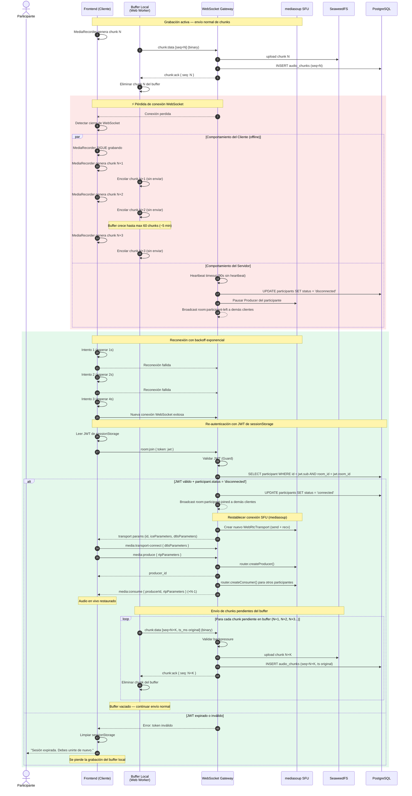
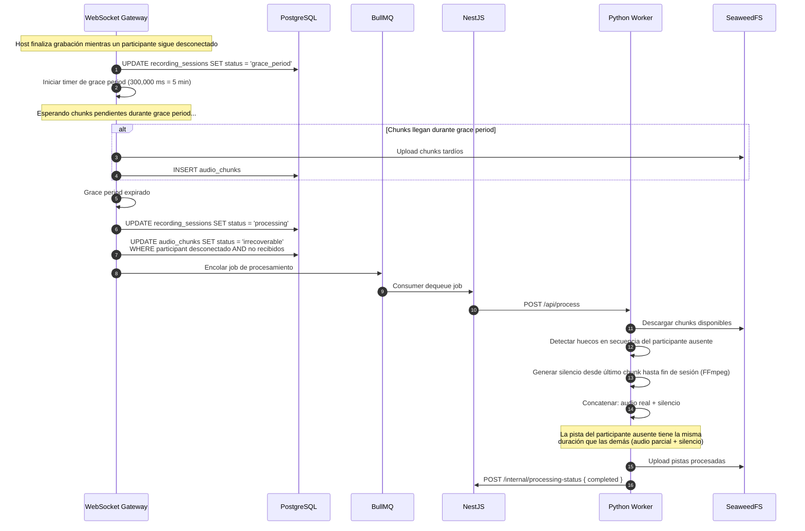

# Diagrama de Secuencia — Reconexión Durante Grabación Activa

> **Referencia TDD:** §6.4 Manejo de Desconexiones y Reconexiones, §7.7 Reconexión y Re-autenticación, §6.1.2 Buffer y Envío de Chunks

Este diagrama cubre los escenarios 1 y 2 de desconexión (breve y prolongada) durante una sesión de grabación activa, incluyendo el comportamiento del buffer local, la re-autenticación, y el restablecimiento del SFU.

## Escenario 3 — Participante no regresa (grace period)

