# Diagrama de Secuencia — Negociación mediasoup (SFU Signaling)

> **Referencia TDD:** §6.1.1 Captura de Audio Local, §6.2.2 Eventos WebSocket (media:*), §5.2 Diagrama de Componentes

Este diagrama detalla el handshake completo entre un cliente y el servidor para establecer la conexión con el SFU mediasoup. Se muestra el flujo para un participante que se une a una sala donde ya existe otro participante.

```mermaid
sequenceDiagram
    autonumber

    participant Client_A as Cliente A<br/>(ya en sala)
    participant Client_B as Cliente B<br/>(nuevo)
    participant WS as WebSocket Gateway<br/>(NestJS)
    participant MS as mediasoup Worker<br/>(SFU - mismo proceso)

    note over Client_B, MS: Cliente B se une a la sala (ya autenticado por JWT)

    %% ─── PASO 1: Obtener RTP Capabilities del Router ───
    rect rgb(59, 130, 246, 0.06)
        note over Client_B, MS: Paso 1 — Obtener capacidades del Router

        Client_B ->> WS: room:join { token: jwt }
        WS ->> MS: router.rtpCapabilities
        WS -->> Client_B: { rtpCapabilities }
        Client_B ->> Client_B: mediasoupDevice.load({ routerRtpCapabilities })
    end

    %% ─── PASO 2: Crear Send Transport ───
    rect rgb(34, 197, 94, 0.06)
        note over Client_B, MS: Paso 2 — Crear Transport de envío (uplink)

        Client_B ->> WS: createWebRtcTransport { direction: 'send' }
        WS ->> MS: router.createWebRtcTransport({ listenIps, enableUdp, enableTcp })
        MS -->> WS: transport { id, iceParameters, iceCandidates, dtlsParameters }
        WS -->> Client_B: { transportId, iceParameters, iceCandidates, dtlsParameters }

        Client_B ->> Client_B: device.createSendTransport(params)

        note over Client_B: Transport.on('connect') se dispara al producir

        Client_B ->> WS: media:transport-connect { transportId, dtlsParameters }
        WS ->> MS: transport.connect({ dtlsParameters })
        note over MS: DTLS handshake completado
    end

    %% ─── PASO 3: Crear Recv Transport ───
    rect rgb(168, 85, 247, 0.06)
        note over Client_B, MS: Paso 3 — Crear Transport de recepción (downlink)

        Client_B ->> WS: createWebRtcTransport { direction: 'recv' }
        WS ->> MS: router.createWebRtcTransport(...)
        MS -->> WS: transport { id, iceParameters, iceCandidates, dtlsParameters }
        WS -->> Client_B: { transportId, iceParameters, iceCandidates, dtlsParameters }

        Client_B ->> Client_B: device.createRecvTransport(params)

        Client_B ->> WS: media:transport-connect { transportId, dtlsParameters }
        WS ->> MS: transport.connect({ dtlsParameters })
    end

    %% ─── PASO 4: Producir audio (uplink) ───
    rect rgb(234, 179, 8, 0.06)
        note over Client_B, MS: Paso 4 — Producir audio (enviar al SFU)

        Client_B ->> Client_B: getUserMedia() → audioTrack
        Client_B ->> WS: media:produce { transportId, kind: 'audio', rtpParameters }
        WS ->> MS: sendTransport.produce({ kind: 'audio', rtpParameters })
        MS -->> WS: producer { id }
        WS ->> WS: Registrar producer de Client_B en sala
        WS -->> Client_B: { producerId }
        note over Client_B, MS: Client B ahora envía audio al SFU (1 uplink)
    end

    %% ─── PASO 5: Consumir audio existente (downlink) ───
    rect rgb(236, 72, 153, 0.06)
        note over Client_B, MS: Paso 5 — Consumir audio de participantes existentes

        WS ->> WS: Buscar producers existentes en la sala (Client A)

        WS ->> MS: recvTransport_B.consume({<br/>  producerId: producer_A.id,<br/>  rtpCapabilities: clientB_caps<br/>})
        MS ->> MS: Verificar compatibilidad RTP
        MS -->> WS: consumer { id, producerId, kind, rtpParameters }
        WS -->> Client_B: media:consume { consumerId, producerId,<br/>kind: 'audio', rtpParameters, participantName }
        Client_B ->> Client_B: recvTransport.consume(params) → audioTrack
        Client_B ->> Client_B: Conectar track a <audio> element
        note over Client_B: Client B ahora escucha a Client A
    end

    %% ─── PASO 6: Notificar a Client A que consuma a Client B ───
    rect rgb(20, 184, 166, 0.06)
        note over Client_A, MS: Paso 6 — Client A consume al nuevo participante (Client B)

        WS ->> MS: recvTransport_A.consume({<br/>  producerId: producer_B.id,<br/>  rtpCapabilities: clientA_caps<br/>})
        MS -->> WS: consumer { id, producerId, kind, rtpParameters }
        WS -->> Client_A: media:consume { consumerId, producerId,<br/>kind: 'audio', rtpParameters, participantName }
        Client_A ->> Client_A: recvTransport.consume(params) → audioTrack
        Client_A ->> Client_A: Conectar track a <audio> element
        note over Client_A: Client A ahora escucha a Client B
    end

    note over Client_A, MS: Comunicación bidireccional establecida vía SFU<br/>Client A: 1 Producer (up) + 1 Consumer (down)<br/>Client B: 1 Producer (up) + 1 Consumer (down)

    %% ─── Cierre de Producer ───
    rect rgb(107, 114, 128, 0.06)
        note over Client_B, Client_A: Ejemplo: Client B se mutea o desconecta

        Client_B ->> WS: media:producer-pause (o producer se cierra)
        WS ->> MS: producer.pause() / producer.close()
        WS -->> Client_A: media:producer-closed { producerId }
        Client_A ->> Client_A: Remover audio track de Client B
    end
```

