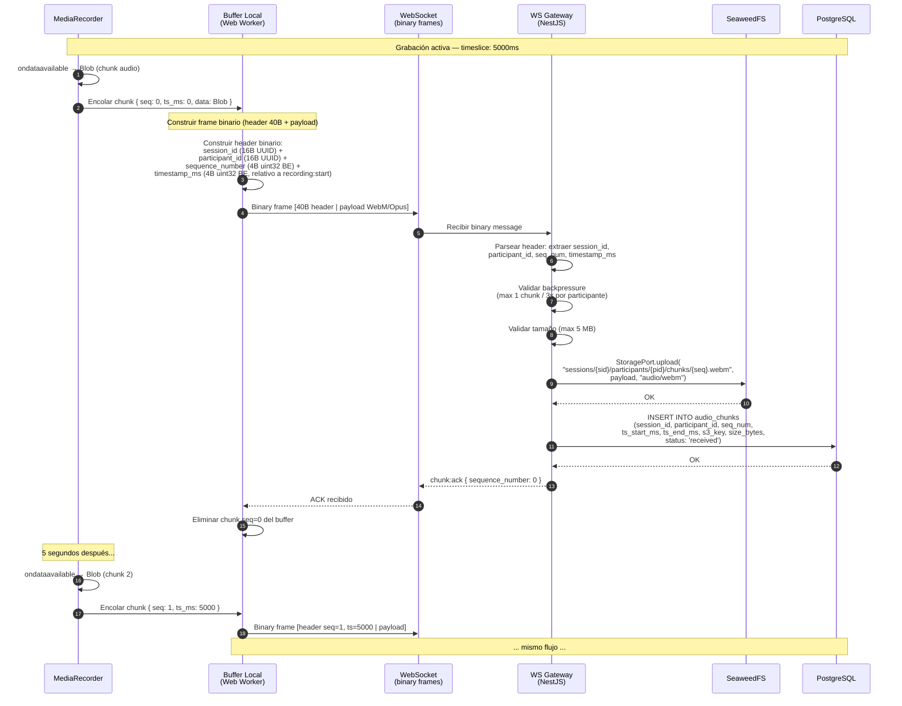
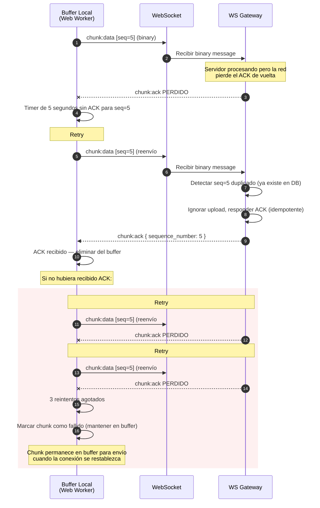
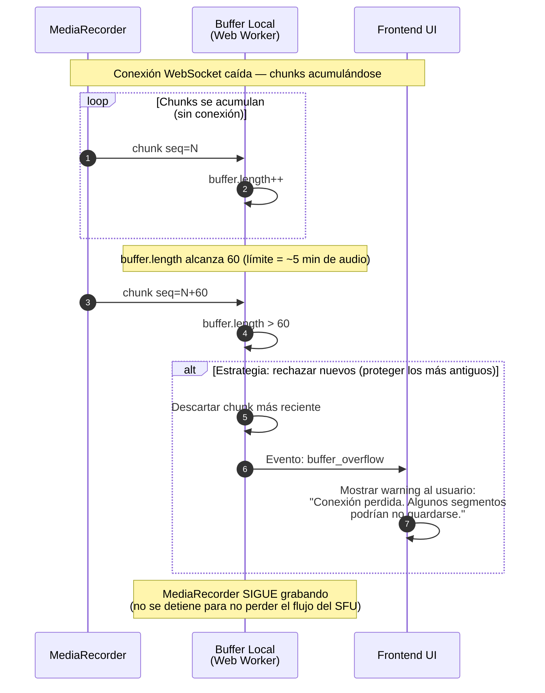

# Diagrama de Secuencia — Protocolo de Envío de Chunks con ACK

> **Referencia TDD:** §6.1.2 Buffer y Envío de Chunks, §6.2.3 Gestión de Chunks en S3, §6.2.4 Límites y Backpressure

Este diagrama detalla el protocolo binario de envío de chunks, el mecanismo de ACK/retry, y los edge cases de buffer overflow y backpressure.

## Flujo normal con ACK

## Flujo con retry (ACK no recibido)

## Edge case: Buffer overflow sin conexión

