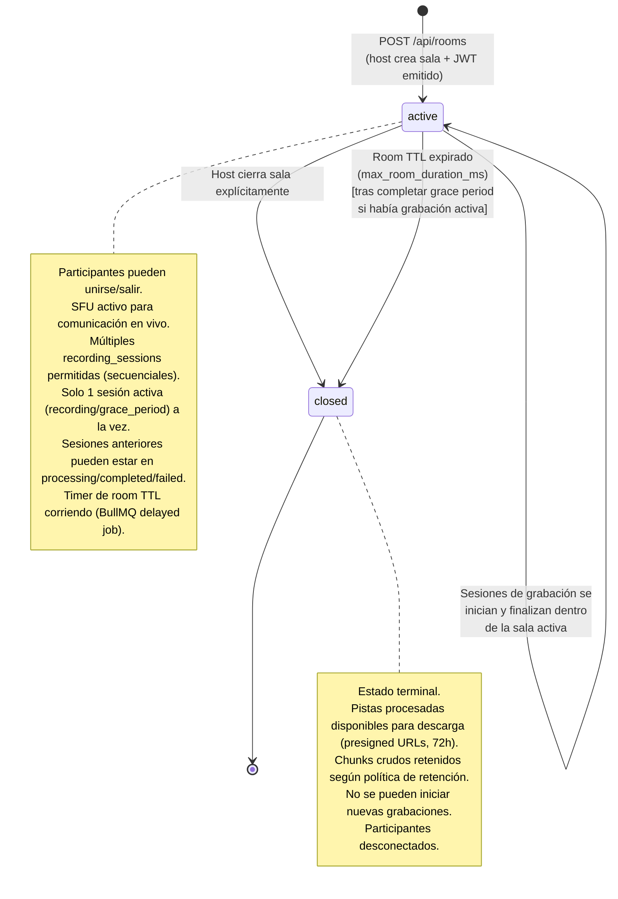
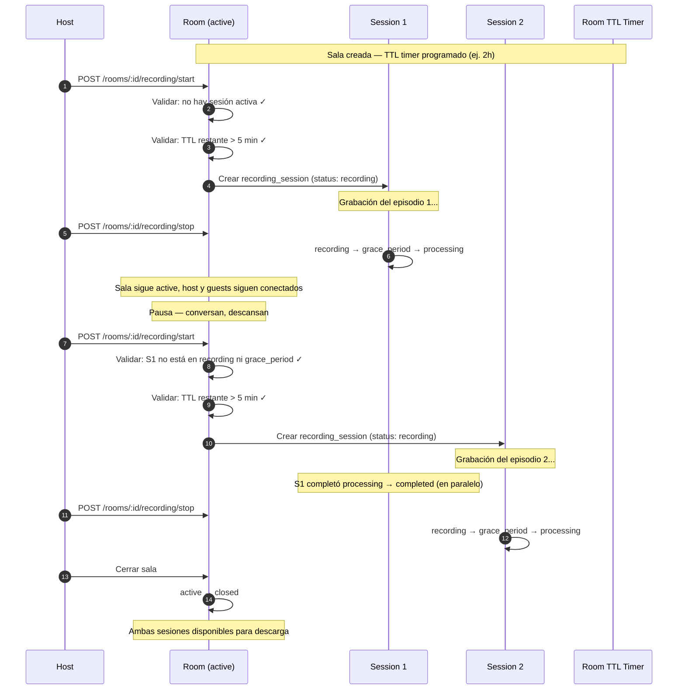
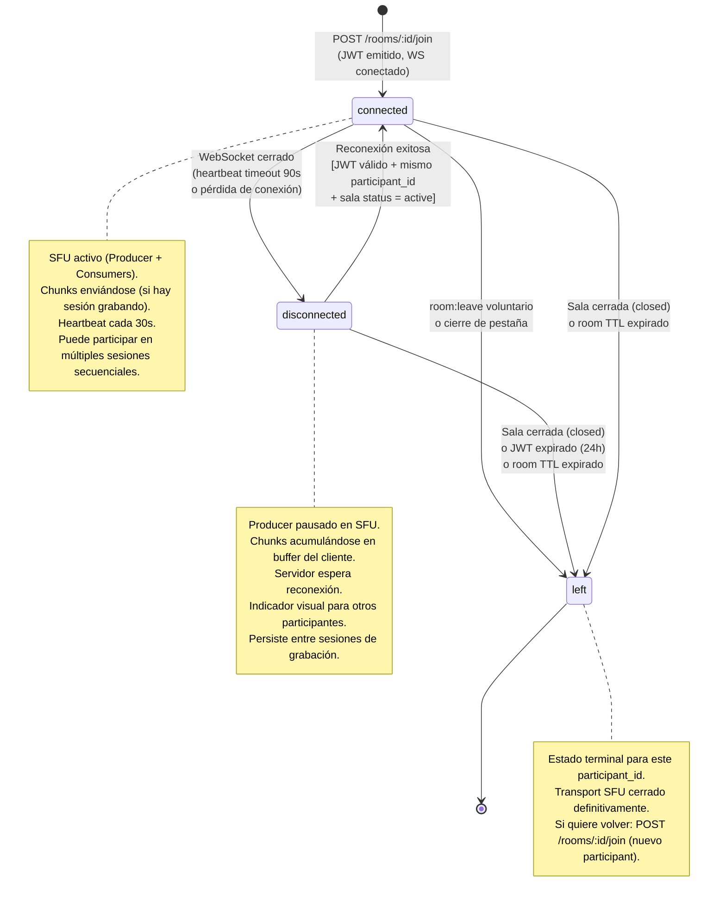
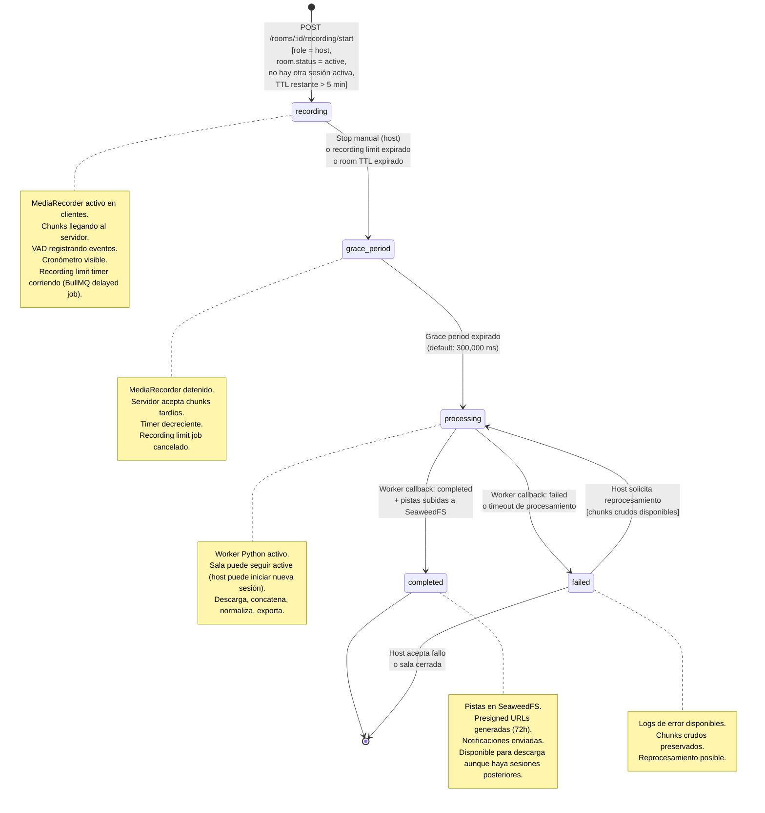
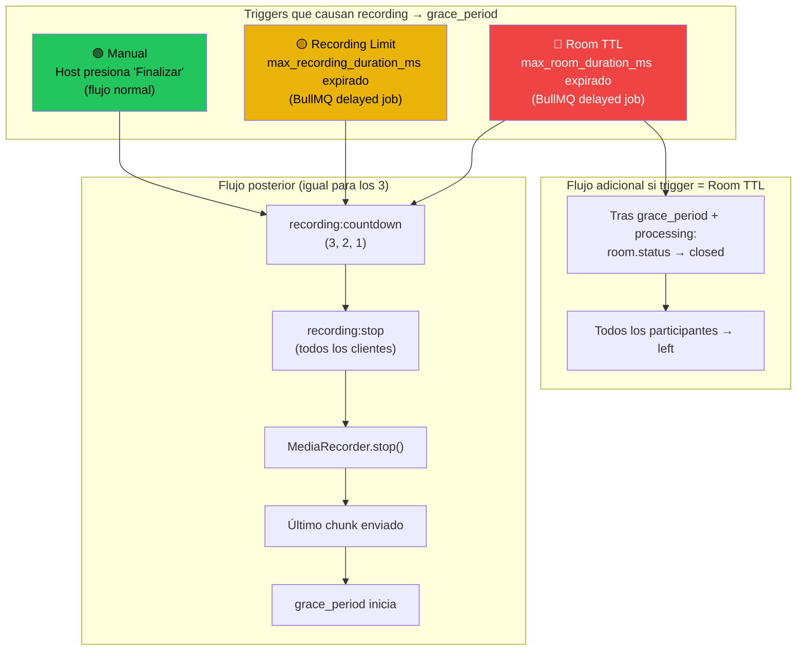

# Diagramas de Estado — Room, Participant, Recording Session (v2)

> **Referencia TDD:** §6.6 Modelo de Datos
> **Actualizado por:** ADR-001 (Múltiples sesiones por sala y límites de tiempo configurables)
>
> **Cambios respecto a v1:**
> - `rooms.status` simplificado de 4 estados (`waiting/recording/processing/closed`) a 2 (`active/closed`)
> - Transiciones de `recording_sessions` sin cambios funcionales, pero con nuevos triggers de forzado por room TTL y recording limit
> - `participants.status` sin cambios, pero con nuevo trigger de cierre forzado por room TTL
> - Nuevos eventos WebSocket de advertencia de tiempo

---

## 1. Estados de una Sala (`rooms.status`)

### Ciclo de vida detallado de una sala con múltiples sesiones

### Reglas de transición

| Transición | Condición de guarda | Acción |
|---|---|---|
| `active → active` (iniciar grabación) | No hay sesión en `recording` ni `grace_period` AND TTL restante > umbral mínimo (5 min) | Crear nueva `recording_session`, programar recording limit job |
| `active → closed` (host cierra) | Acción explícita del host | Si hay grabación activa: forzar stop → countdown → grace period → processing. Luego cerrar sala. Cancelar room TTL job |
| `active → closed` (TTL expirado) | `Date.now() - room.created_at >= max_room_duration_ms` | Mismo flujo que cierre por host. Warning emitido 5 min antes |

### Transiciones NO permitidas

| Transición | Razón |
|---|---|
| `closed → active` | Estado terminal. Para nueva actividad, crear nueva sala |
| Dos sesiones `recording` simultáneas | Restricción explícita (ADR-001 D3). Una sala solo puede tener una sesión grabando a la vez |

---

## 2. Estados de un Participante (`participants.status`)

### Cambios respecto a v1

- Nuevo trigger `connected → left` por expiración de room TTL. Cuando el TTL expira y la sala se cierra, todos los participantes conectados pasan a `left`.
- Nuevo trigger `disconnected → left` por expiración de room TTL. Participantes desconectados cuando la sala se cierra también pasan a `left`.
- Explicitado: un participante `connected` persiste entre sesiones de grabación. No necesita re-unirse cuando el host inicia una nueva grabación.

---

## 3. Estados de una Sesión de Grabación (`recording_sessions.status`)

### Triggers de forzado automático (nuevos en v2)

### Condiciones de guarda detalladas

| Transición | Condiciones | Acciones |
|---|---|---|
| `[*] → recording` | (1) `room.status = active` (2) No existe otra sesión con status `recording` o `grace_period` en la misma sala (3) `room.remaining_ttl > min_recording_threshold` (5 min) (4) `participant.role = host` | Crear `recording_session`, programar recording limit delayed job en BullMQ, emitir `recording:countdown` + `recording:start` |
| `recording → grace_period` (manual) | Host ejecuta stop | Cancelar recording limit job, emitir countdown + `recording:stop`, iniciar grace period timer |
| `recording → grace_period` (recording limit) | `Date.now() - session.started_at >= max_recording_duration_ms` | Emitir `recording:time-expired` + countdown + `recording:stop`, iniciar grace period timer |
| `recording → grace_period` (room TTL) | Room TTL job se dispara | Emitir `room:time-expired` + `recording:time-expired` + countdown + `recording:stop`, iniciar grace period timer. Programar cierre de sala tras grace period |
| `grace_period → processing` | Timer de grace period expirado | Marcar chunks faltantes como `irrecoverable`, encolar job en BullMQ, disparar HTTP al worker Python |
| `processing → completed` | Worker reporta éxito via callback | INSERT `processed_tracks`, generar presigned URLs, enviar notificaciones por email/webhook |
| `processing → failed` | Worker reporta error o timeout | Log de error, notificar al host, ofrecer reprocesamiento |
| `failed → processing` | Host solicita reprocesamiento | Re-encolar job en BullMQ, con mismo o diferente `processing_preset` |

---

## 4. Eventos WebSocket de Advertencia de Tiempo (nuevos)

```mermaid
sequenceDiagram
    autonumber

    participant SERVER as NestJS (Timer)
    participant HOST as Host (Frontend)
    participant GUESTS as Guests (Frontend)

    Note over SERVER: Recording limit: 5 min restantes

    SERVER -->> HOST: recording:time-warning { remaining_ms: 300000 }
    HOST ->> HOST: Mostrar banner: "5 minutos restantes de grabación"

    Note over SERVER: Recording limit expirado

    SERVER -->> HOST: recording:time-expired
    SERVER -->> GUESTS: recording:time-expired
    SERVER ->> SERVER: Forzar recording:stop (mismo flujo que stop manual)

    Note over SERVER: Room TTL: 5 min restantes

    SERVER -->> HOST: room:time-warning { remaining_ms: 300000 }
    SERVER -->> GUESTS: room:time-warning { remaining_ms: 300000 }
    HOST ->> HOST: Mostrar banner: "5 minutos restantes de sala"
    GUESTS ->> GUESTS: Mostrar banner: "5 minutos restantes de sala"

    Note over SERVER: Room TTL expirado

    SERVER -->> HOST: room:time-expired
    SERVER -->> GUESTS: room:time-expired
    Note over SERVER: Si hay grabación activa: forzar stop → grace period → processing → close
    Note over SERVER: Si no hay grabación: cerrar sala directamente
```

