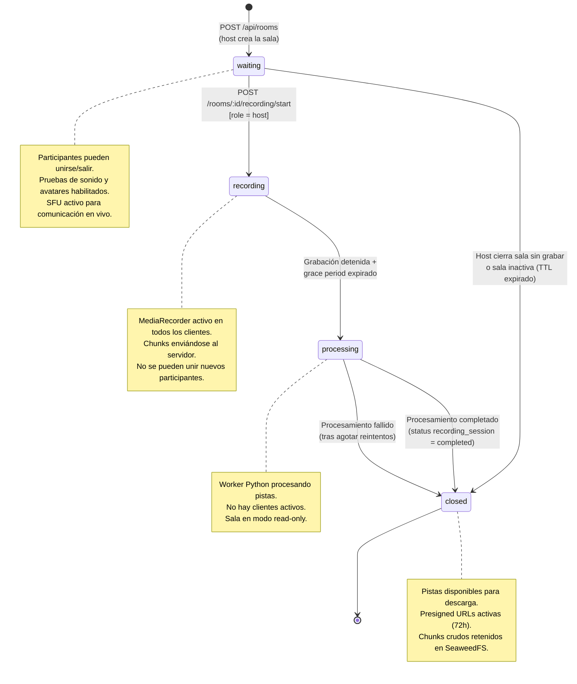
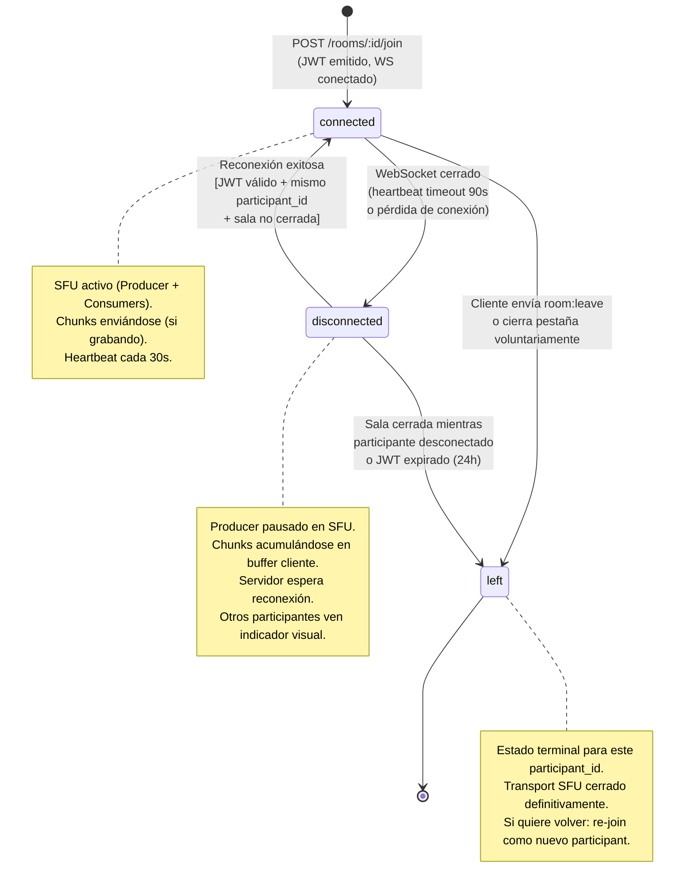
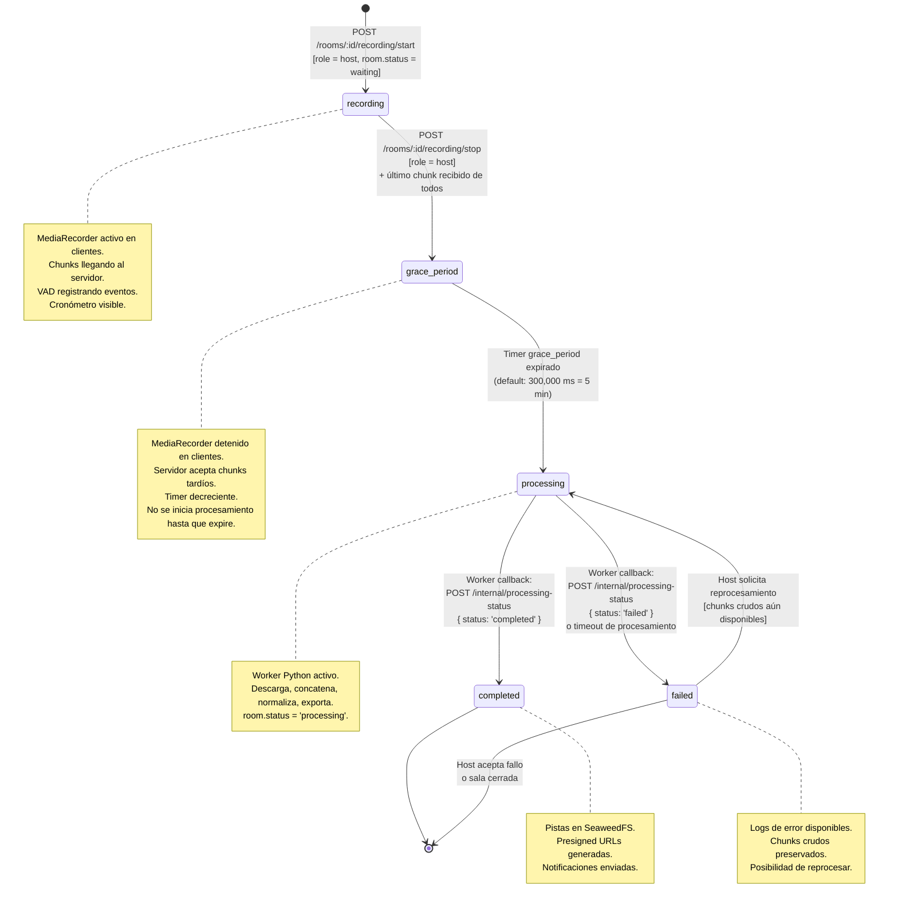

# Diagramas de Estado — Room, Participant, Recording Session

> **Referencia TDD:** §6.6 Modelo de Datos (enums de status), §6.4 Manejo de Desconexiones, §5.3 Flujo de Datos Principal

Estos diagramas formalizan las transiciones de estado que están implícitas en el TDD, resolviendo ambigüedades sobre transiciones válidas y condiciones de guarda.

---

## 1. Estados de una Sala (`rooms.status`)

### Transiciones NO permitidas (explicitadas)

| Transición | Razón |
|---|---|
| `recording → waiting` | No se puede "deshacer" una grabación. Si el host quiere volver a grabar, se crea una nueva `recording_session` dentro de la misma sala (volver a `waiting` requiere que la sesión anterior complete su ciclo). |
| `processing → recording` | El procesamiento es terminal para esa sesión. Se puede iniciar una nueva sesión de grabación si la sala vuelve a `waiting` tras completar el procesamiento. |
| `closed → *` | Estado terminal. Para nueva grabación, crear nueva sala. |

> 🟡 **IMPORTANTE — Ambigüedad en el TDD:** El documento no especifica si una sala puede volver a `waiting` después de `processing → completed` para permitir múltiples sesiones de grabación en la misma sala. Esto requiere decisión explícita. El diagrama actual asume que cada sala tiene una única sesión de grabación. Si se permiten múltiples sesiones, se necesita la transición `closed → waiting` o `processing → waiting`.

---

## 2. Estados de un Participante (`participants.status`)

### Reglas de transición clave

| Regla | Detalle |
|---|---|
| `disconnected → connected` | Solo si: (1) JWT no expirado, (2) sala no está `closed`, (3) `participant_id` del JWT coincide con registro en DB. Si falla cualquier condición → el participante debe hacer re-join como nuevo guest. |
| `connected → left` vs `connected → disconnected` | `left` es intencional (el usuario cerró o salió). `disconnected` es involuntario (pérdida de red). La diferencia importa porque `disconnected` permite reconexión automática; `left` no. |
| No existe `left → connected` | Un participante que salió voluntariamente no puede regresar con el mismo `participant_id`. Debe crear uno nuevo. |

---

## 3. Estados de una Sesión de Grabación (`recording_sessions.status`)

### Detalle de condiciones de guarda

| Transición | Condición | Acción |
|---|---|---|
| `recording → grace_period` | Host ejecuta stop + countdown finaliza | Enviar `recording:stop` a todos, iniciar timer |
| `grace_period → processing` | `Date.now() - endedAt >= grace_period_ms` | Marcar chunks faltantes como `irrecoverable`, encolar job en BullMQ |
| `processing → completed` | Worker reporta éxito + pistas subidas a S3 | INSERT `processed_tracks`, generar presigned URLs, enviar notificaciones |
| `processing → failed` | Worker reporta error o no responde en timeout | Log de error, notificar al host, ofrecer reprocesamiento |
| `failed → processing` | Host invoca reprocesamiento manual | Re-encolar job en BullMQ con mismos o diferentes presets |
