# Diagrama Entidad-Relación — Modelo de Datos

> **Referencia TDD:** §6.6 Modelo de Datos

Diagrama completo de las 11 tablas definidas en el TDD, con tipos de datos, claves foráneas, cardinalidad, y enums.

```mermaid
erDiagram
    rooms {
        UUID id PK
        VARCHAR_8 code UK "crypto.randomBytes, alfanumérico"
        ENUM status "waiting | recording | processing | closed"
        TIMESTAMP created_at
    }

    room_settings {
        UUID id PK
        UUID room_id FK, UK "1:1 con rooms"
        INT chunk_interval_ms "default: 5000"
        INT grace_period_ms "default: 300000 (5 min)"
        INT max_participants "default: 5"
        ENUM export_format "flac | wav | mp3, default: flac"
    }

    participants {
        UUID id PK
        UUID room_id FK
        VARCHAR display_name
        VARCHAR email "nullable"
        ENUM role "host | guest"
        ENUM status "connected | disconnected | left"
        TIMESTAMP joined_at
    }

    participant_avatars {
        UUID id PK
        UUID participant_id FK, UK "1:1 con participants"
        VARCHAR idle_image_s3_key
        VARCHAR speaking_image_s3_key
    }

    recording_sessions {
        UUID id PK
        UUID room_id FK
        TIMESTAMP started_at
        TIMESTAMP ended_at "nullable"
        ENUM status "recording | grace_period | processing | completed | failed"
    }

    processing_presets {
        UUID id PK
        UUID session_id FK, UK "1:1 con recording_sessions"
        BOOLEAN noise_reduction "default: false"
        DECIMAL normalize_lufs "default: -16"
        ENUM export_format "flac | wav | mp3 | null (hereda room_settings)"
    }

    audio_chunks {
        UUID id PK
        UUID session_id FK
        UUID participant_id FK
        INT seq_num "uint32"
        INT ts_start_ms "relativo al inicio de grabación"
        INT ts_end_ms
        VARCHAR s3_key "sessions/sid/participants/pid/chunks/N.webm"
        INT size_bytes
        ENUM status "received | processing | irrecoverable"
        TIMESTAMP received_at
    }

    vad_events {
        UUID id PK
        UUID session_id FK
        UUID participant_id FK
        ENUM state "speaking | silent"
        INT ts_ms "relativo al inicio de grabación"
    }

    timestamp_marks {
        UUID id PK
        UUID session_id FK
        UUID participant_id FK
        INT ts_ms "relativo al inicio de grabación"
        VARCHAR label "nullable"
    }

    processed_tracks {
        UUID id PK
        UUID session_id FK
        UUID participant_id FK "nullable — null para mezcla final"
        ENUM format "flac | wav | mp3"
        ENUM variant "raw | denoised | mix"
        VARCHAR s3_key
        INT duration_ms
    }

    notifications {
        UUID id PK
        UUID session_id FK
        UUID participant_id FK
        ENUM type "email | webhook"
        TIMESTAMP sent_at
        VARCHAR download_url "presigned URL, 72h expiración"
    }

    %% ─── RELACIONES ───

    rooms ||--o| room_settings : "tiene configuración"
    rooms ||--o{ participants : "tiene participantes (max 5)"
    rooms ||--o{ recording_sessions : "tiene sesiones"

    participants ||--o| participant_avatars : "tiene avatar"
    participants ||--o{ audio_chunks : "genera chunks"
    participants ||--o{ vad_events : "genera eventos VAD"
    participants ||--o{ timestamp_marks : "crea marcas"
    participants ||--o{ notifications : "recibe notificaciones"

    recording_sessions ||--o| processing_presets : "tiene preset"
    recording_sessions ||--o{ audio_chunks : "contiene chunks"
    recording_sessions ||--o{ vad_events : "contiene eventos VAD"
    recording_sessions ||--o{ timestamp_marks : "contiene marcas"
    recording_sessions ||--o{ processed_tracks : "produce pistas"
    recording_sessions ||--o{ notifications : "genera notificaciones"
```

## Índices recomendados

| Tabla | Índice | Tipo | Justificación |
|---|---|---|---|
| `rooms` | `code` | UNIQUE | Lookup por código de invitación |
| `audio_chunks` | `(session_id, participant_id, seq_num)` | UNIQUE | Prevenir chunks duplicados (idempotencia en retry) |
| `audio_chunks` | `(session_id, participant_id)` | INDEX | Query de descarga por participante en worker |
| `vad_events` | `(session_id, participant_id, ts_ms)` | INDEX | Exportación ordenada de eventos VAD |
| `participants` | `(room_id, role)` | INDEX | Lookup rápido del host de una sala |
| `processed_tracks` | `(session_id)` | INDEX | Listado de pistas para página de descarga |
| `notifications` | `(session_id, participant_id)` | INDEX | Verificar si ya se notificó a un participante |

## Notas sobre el diseño

- **Resolución de circularidad host:** No hay `host_participant_id` en `rooms`. El host se identifica filtrando `participants WHERE room_id = X AND role = 'host'`.
- **`processing_presets.export_format` nullable:** Si es `null`, se hereda `room_settings.export_format`. El worker debe hacer este fallback al consultar la configuración.
- **`processed_tracks.participant_id` nullable:** Cuando `participant_id IS NULL`, la pista es la mezcla final (`variant = 'mix'`).
- **Cardinalidad `rooms → recording_sessions`:** El TDD no prohíbe explícitamente múltiples sesiones por sala, pero el flujo implica una sola sesión activa a la vez.
