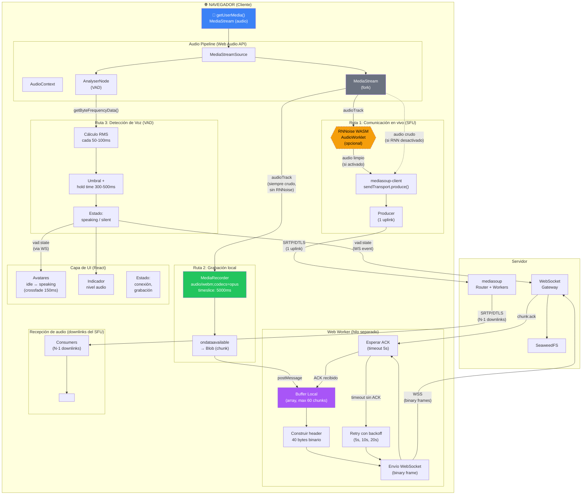

# Diagrama de Arquitectura del Cliente — Flujo de Datos Interno

> **Referencia TDD:** §6.1.1 Captura de Audio Local, §6.1.2 Buffer y Envío de Chunks, §6.5 Reducción de Ruido (Nivel 1), §6.7.1 Voice Activity Detection

Este diagrama muestra cómo un único stream de `getUserMedia()` alimenta simultáneamente tres subsistemas independientes en el cliente: el SFU (comunicación en vivo), MediaRecorder (grabación local), y el VAD (detección de voz). Además muestra el flujo del Web Worker para envío de chunks.

## Puntos clave del diseño

| Aspecto | Detalle |
|---|---|
| **RNNoise solo afecta SFU** | La grabación local siempre captura audio crudo, sin importar si RNNoise está activo. Esto preserva la calidad máxima para post-producción. |
| **Web Worker aislado** | El buffer y envío de chunks operan en un hilo separado para no bloquear el hilo principal (UI + Web Audio API). |
| **VAD usa AnalyserNode nativo** | Sin librerías externas. < 1% CPU. Los eventos se emiten por WebSocket para animar avatares en todos los clientes. |
| **MediaRecorder independiente** | No depende del SFU. Si mediasoup falla, la grabación local continúa sin interrupción. |
| **Un solo getUserMedia()** | Se solicita el micrófono una sola vez. El stream se bifurca a los tres subsistemas sin duplicar la captura. |
