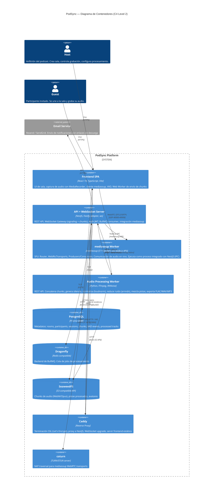
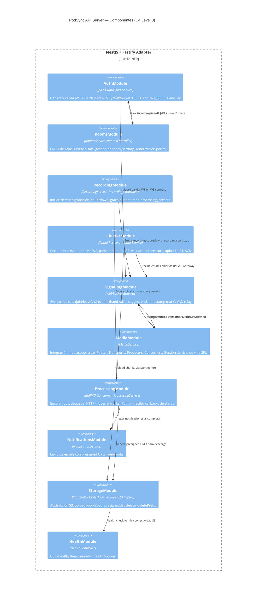
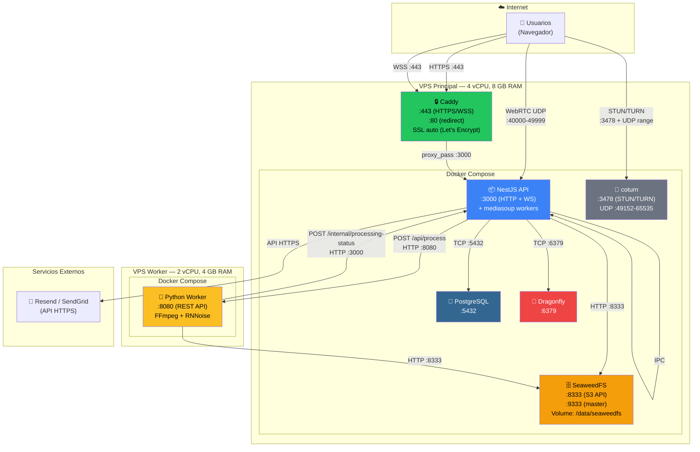

# Diagramas C4 — Contenedores y Despliegue

> **Referencia TDD:** §5.1 Visión General, §5.2 Diagrama de Componentes, §15 Estimación de Costos de Infraestructura, §8 Consideraciones de Seguridad

---

## C4 Nivel 2 — Diagrama de Contenedores

Muestra los contenedores (procesos desplegables) del sistema PodSync y sus interacciones principales.

---

## C4 Nivel 3 — Componentes del API Server (NestJS)

Detalle de los módulos internos del servidor NestJS.

---

## Diagrama de Despliegue (Infraestructura)

Vista de distribución física de contenedores en servidores, con puertos y protocolos.

## Puertos y protocolos (resumen)

| Servicio | Puerto(s) | Protocolo | Expuesto a Internet |
|---|---|---|---|
| Caddy | 443, 80 | HTTPS, HTTP (redirect) | ✅ |
| NestJS | 3000 | HTTP + WebSocket | ❌ (solo via Caddy) |
| mediasoup | 40000-49999 | UDP (WebRTC DTLS/SRTP) | ✅ (requiere apertura) |
| coturn | 3478, 49152-65535 | UDP/TCP (STUN/TURN) | ✅ |
| PostgreSQL | 5432 | TCP | ❌ |
| Dragonfly | 6379 | TCP | ❌ |
| SeaweedFS | 8333, 9333 | HTTP | ❌ |
| Python Worker | 8080 | HTTP | ❌ |

> 🟡 **IMPORTANTE:** mediasoup requiere que los puertos UDP 40000-49999 estén abiertos en el firewall del VPS para tráfico WebRTC directo. Esto se configura en `mediasoup.WebRtcTransport.listenIps`. coturn opera como fallback para clientes detrás de NAT restrictivo.
