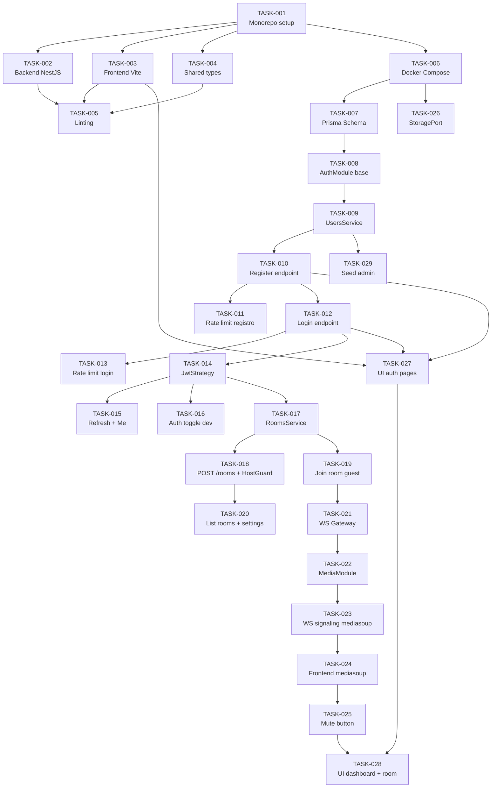

# PodSync — Hito 1: Infraestructura, Autenticación y Comunicación Básica

## Plan de Historias de Usuario y Tareas

**Versión:** 1.0
**Fecha:** Abril 2026
**Referencia:** TDD v1.6 — §11.1, §4.2, §5, §6.2.1, §6.6, §7, §8
**Metodología de desarrollo:** Test Driven Development (TDD: Red → Green → Refactor)
**Duración estimada del hito:** 5–6 semanas

---

## Índice de Historias de Usuario

| Archivo | Historia | Tareas | Prioridad | Estimación |
|---------|----------|--------|-----------|------------|
| [US-001](US-001_Setup_Monorepo.md) | Setup del Monorepo y Entorno de Desarrollo | 5 | P0-Critical | L (1–2 días) |
| [US-002](US-002_Docker_Compose.md) | Infraestructura con Docker Compose | 1 | P0-Critical | L (1–2 días) |
| [US-003](US-003_Esquema_BD.md) | Esquema de Base de Datos Inicial | 1 | P0-Critical | L (1–2 días) |
| [US-004](US-004_Registro_Host.md) | Registro de Usuario Host | 4 | P0-Critical | XL (3–5 días) |
| [US-005](US-005_Login_Host.md) | Inicio de Sesión (Login) del Host | 2 | P0-Critical | L (1–2 días) |
| [US-006](US-006_Refresh_JWT.md) | Renovación de JWT y Gestión de Sesión | 2 | P1-High | L (1–2 días) |
| [US-007](US-007_Auth_Toggle.md) | Modo Desarrollo sin Autenticación | 1 | P2-Medium | M (4–8h) |
| [US-008](US-008_Crear_Sala.md) | Creación de Sala por Host Autenticado | 2 | P0-Critical | XL (3–5 días) |
| [US-009](US-009_Join_Guest.md) | Ingreso de Guest a Sala | 1 | P0-Critical | L (1–2 días) |
| [US-010](US-010_Listar_Salas.md) | Listado e Información de Salas | 1 | P1-High | M (4–8h) |
| [US-011](US-011_WS_Gateway.md) | WebSocket Gateway con Autenticación | 1 | P0-Critical | XL (3–5 días) |
| [US-012](US-012_Mediasoup.md) | Integración de mediasoup (SFU) | 2 | P0-Critical | XL (3–5 días) |
| [US-013](US-013_Voz_Tiempo_Real.md) | Comunicación de Voz en Tiempo Real | 1 | P0-Critical | XL (3–5 días) |
| [US-014](US-014_Muteo.md) | Muteo y Desmuteo de Micrófono | 1 | P1-High | M (4–8h) |
| [US-015](US-015_StoragePort.md) | Interfaz de Abstracción de Almacenamiento | 1 | P1-High | L (1–2 días) |
| [US-016](US-016_Frontend_UI.md) | Interfaz de Usuario Mínima (Frontend) | 2 | P1-High | XL (3–5 días) |
| [US-017](US-017_Seed.md) | Seed de Desarrollo | 1 | P2-Medium | S (< 4h) |

**Total: 29 tareas · ~5–6 semanas**

---

## Convenciones

- **Tamaño:** S (< 4h) · M (4–8h) · L (1–2 días) · XL (3–5 días)
- **Prioridad:** P0-Critical · P1-High · P2-Medium · P3-Low
- **TDD (Test Driven Development):** Cada tarea de implementación sigue el ciclo Red → Green → Refactor. Los tests se escriben **antes** de la implementación.
- **Referencia TDD:** Cada historia incluye las secciones del documento técnico que la respaldan.

## Política de Versiones

> **⚠️ Las versiones de herramientas, runtimes, imágenes Docker y dependencias mencionadas en este documento son referenciales al momento de su redacción (Abril 2026).** Al implementar cada tarea, el desarrollador debe usar la **última versión estable (stable/LTS)** disponible de cada tecnología, salvo que exista una incompatibilidad documentada que lo impida.
>
> Ejemplos:
> - **Node.js:** Usar la última versión LTS vigente.
> - **PostgreSQL:** Usar la última versión estable (imagen `-alpine` preferida por tamaño).
> - **pnpm:** La versión que Corepack fije como estable al momento del setup.
> - **Dependencias npm/pnpm:** Instalar sin fijar versión (usar `latest`) en el setup inicial, y fijar con lockfile a partir de ahí.
> - **Imágenes Docker:** Usar tag de versión major estable (e.g. `postgres:17-alpine`), nunca `latest` en Docker Compose para reproducibilidad.
>
> Si una versión específica se menciona en un snippet de código o comando, trátese como ejemplo ilustrativo, no como requisito fijo.

---

## Diagrama de Dependencias



## Ruta Crítica

```
TASK-001 → TASK-006 → TASK-007 → TASK-008 → TASK-009 → TASK-010 → TASK-012 → TASK-014
→ TASK-017 → TASK-019 → TASK-021 → TASK-022 → TASK-023 → TASK-024 → TASK-025 → TASK-028
```

**16 tareas en secuencia.** Estimación total de la ruta crítica: ~5 semanas.

Las tareas **fuera de la ruta crítica** que pueden ejecutarse en paralelo:
- TASK-003, TASK-004, TASK-005 (setup frontend y shared — paralelo a backend setup)
- TASK-011, TASK-013 (rate limiting — paralelo a flujo principal)
- TASK-015 (refresh token — paralelo a rooms)
- TASK-016 (auth toggle — paralelo a rooms)
- TASK-020 (list rooms — paralelo a websocket)
- TASK-026 (StoragePort — paralelo tras Docker Compose)
- TASK-027 (UI auth — paralelo a backend rooms)
- TASK-029 (seed — paralelo tras UsersService)

---

*Documento generado como referencia para el desarrollo del Hito 1 de PodSync. Debe actualizarse al inicio de cada sprint según el progreso real y las decisiones tomadas durante la implementación.*
